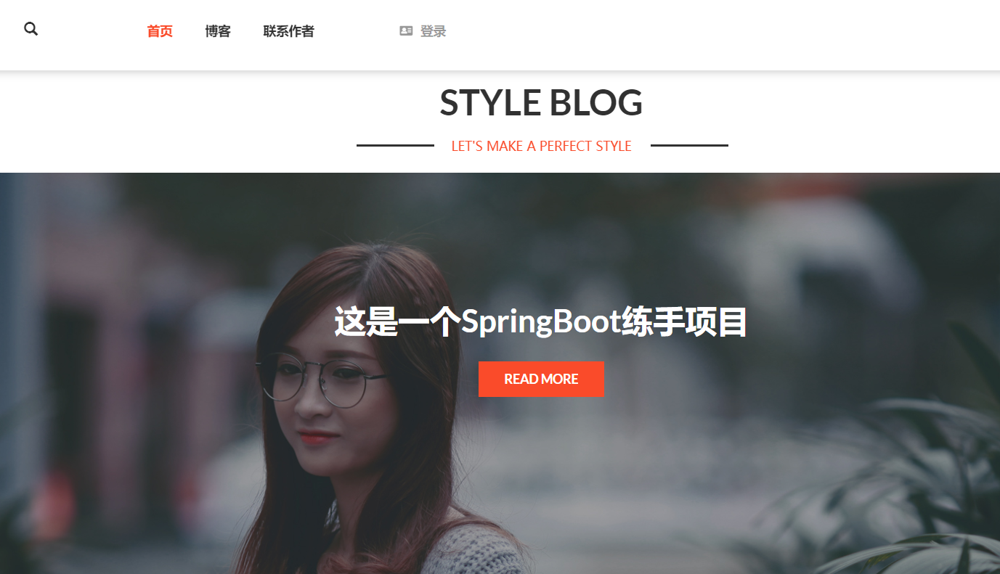
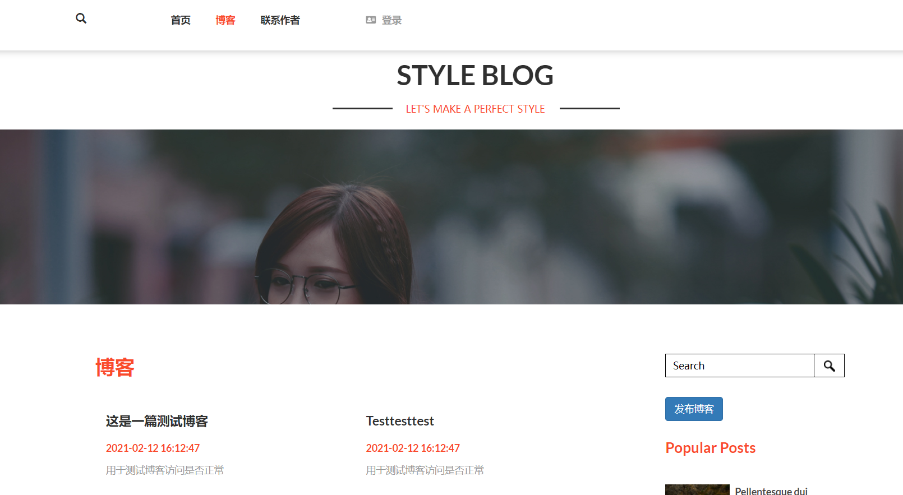

# 概述

这是一个基于SpringBoot开发的一个博客系统，是一个练手的项目

网页前端模板来源：https://sc.chinaz.com/moban/

截图示例：

# 技术要点

安全框架：Shiro

接口文档：Swagger

数据库相关：Druid，Mybatis，PageHelper

富文本编辑器：EditorMD

前端：thymeleaf

# 开发计划

目前实现了博客的发布、浏览、评论

计划后期实现：

- 管理员审核博客
- 管理员删除博客
- 管理员后台
- 用户信息界面

# 联系作者

作者是一名学生，在学习完SpringBoot后练手制作了本项目

如果对本项目有任何建议，或问题，请发送邮件联系：yanshijie.work@aliyun.com

或者直接在Github上issues